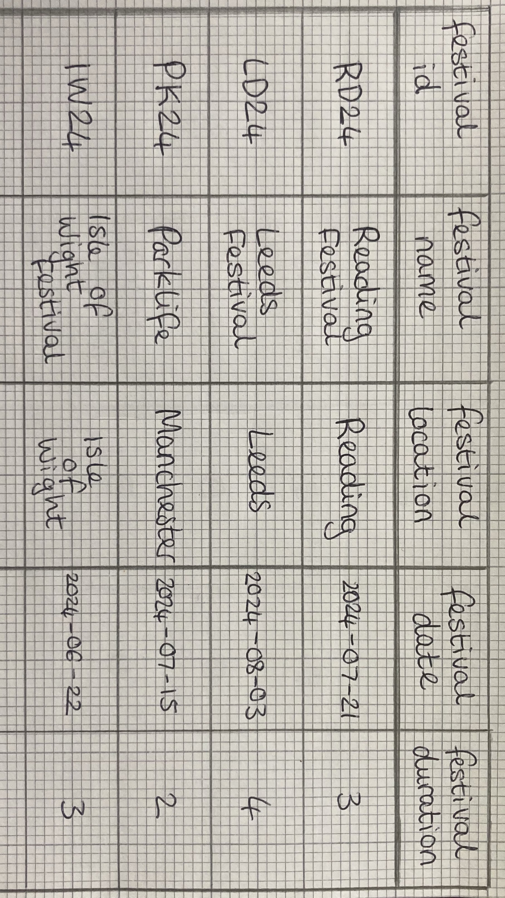
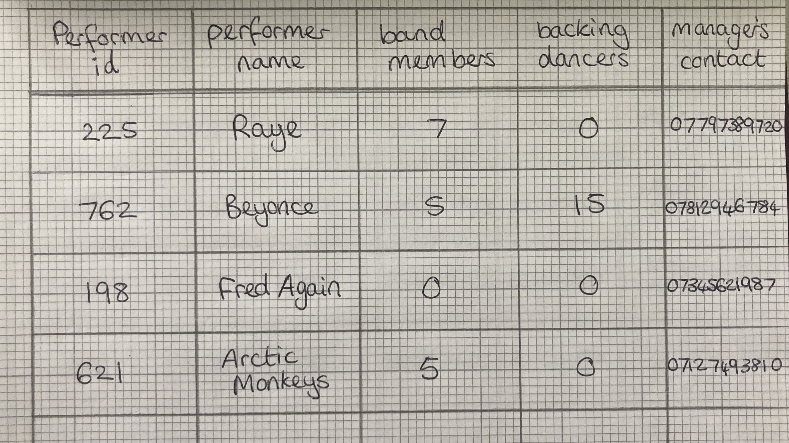
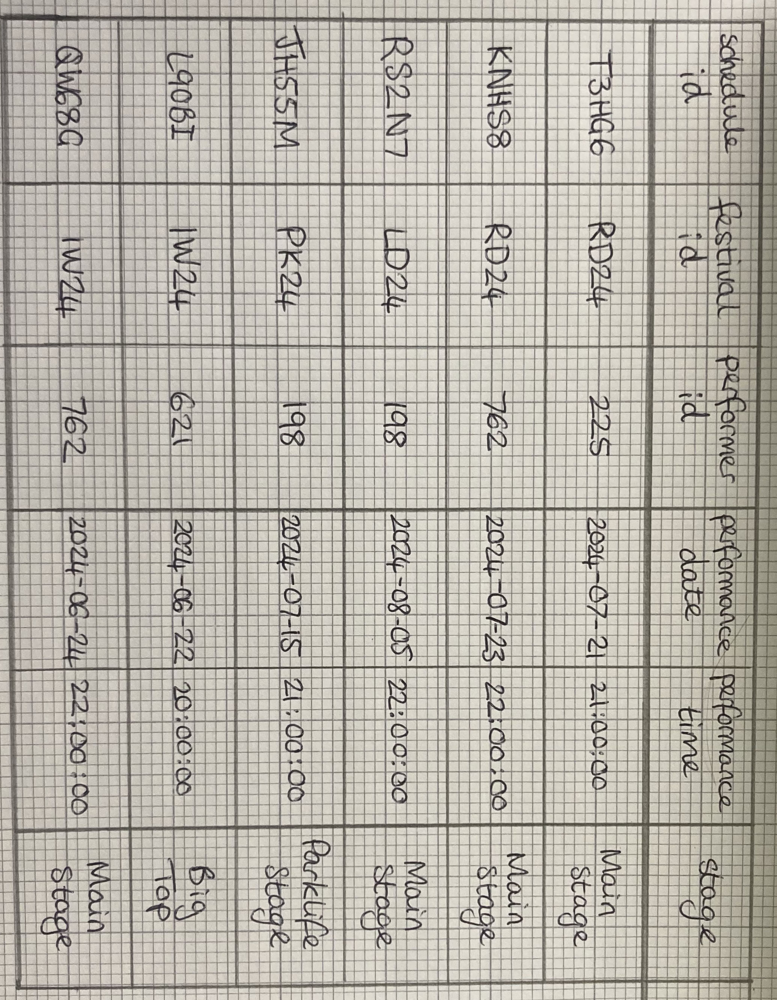

Assignment-3-SQL
# Creative Scenario of Use for Assignment 3 SQL

A company who work in organising acts for a variety of festivals throughout the summer. This requires storing data regarding who the performers are, where they are playing and when. One table will store data about each festival, including the name, date, location and duration. One data will store details about the performers, including their name, band members, backing dancers and managers contact details. Each performer and festival will be given an id to be able to identify them. There will also be a table in which shows the schedules of each act, incorporating data from the first two tables, this will show exactly what time each performer is playing at what festival on what date, and even which stage they are playing on. This will be useful to ensure that there are no conflicts in bookings, and performers aren’t expected to be in two places at the same time. From these tables I can write queries to find out useful information like what acts are playing at what festival, timings, what stage, and/or other information about them. 

I have drawn out some examples of the tables below:

